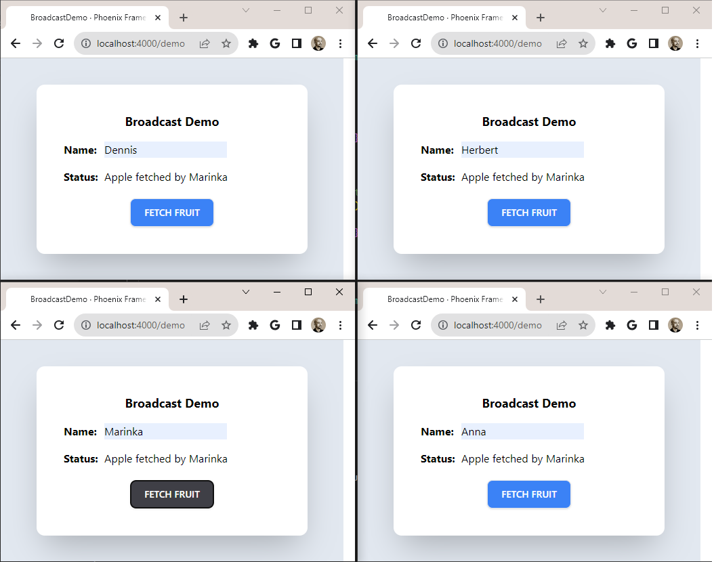

# Broadcast Demo

Basic example of PubSub broadcast in Phoenix.

The app cycles though a list of fruits stored in Sqlite database. Each button press fetches the next fruit. All subscribers are notified after each request. If the request reaches the end of list, it will start again with the first item.

Start with `mix setup`, which gets the dependencies and sets up the database.

Then run `mix phoenix.server` to start the web server.

Open web browser with url `localhost:4000/demo` and type in random name in the Name field. Open additional browser instances and enter different names. When FETCH FRUIT button is pressed, all other clients (subscribers) are notified.

